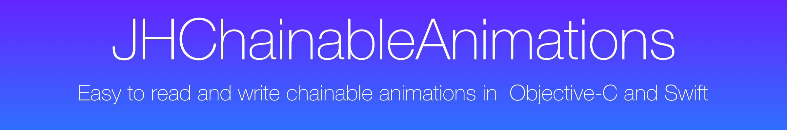
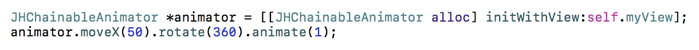
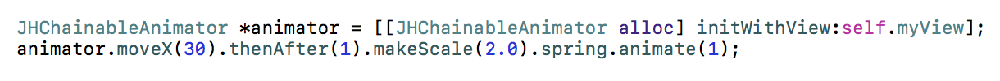
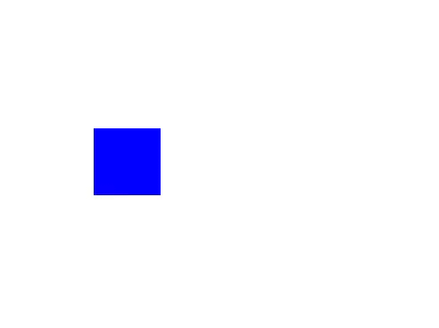
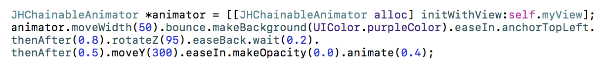
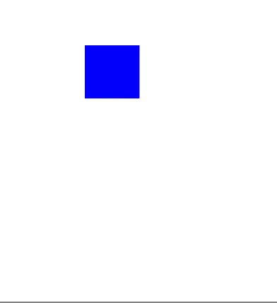
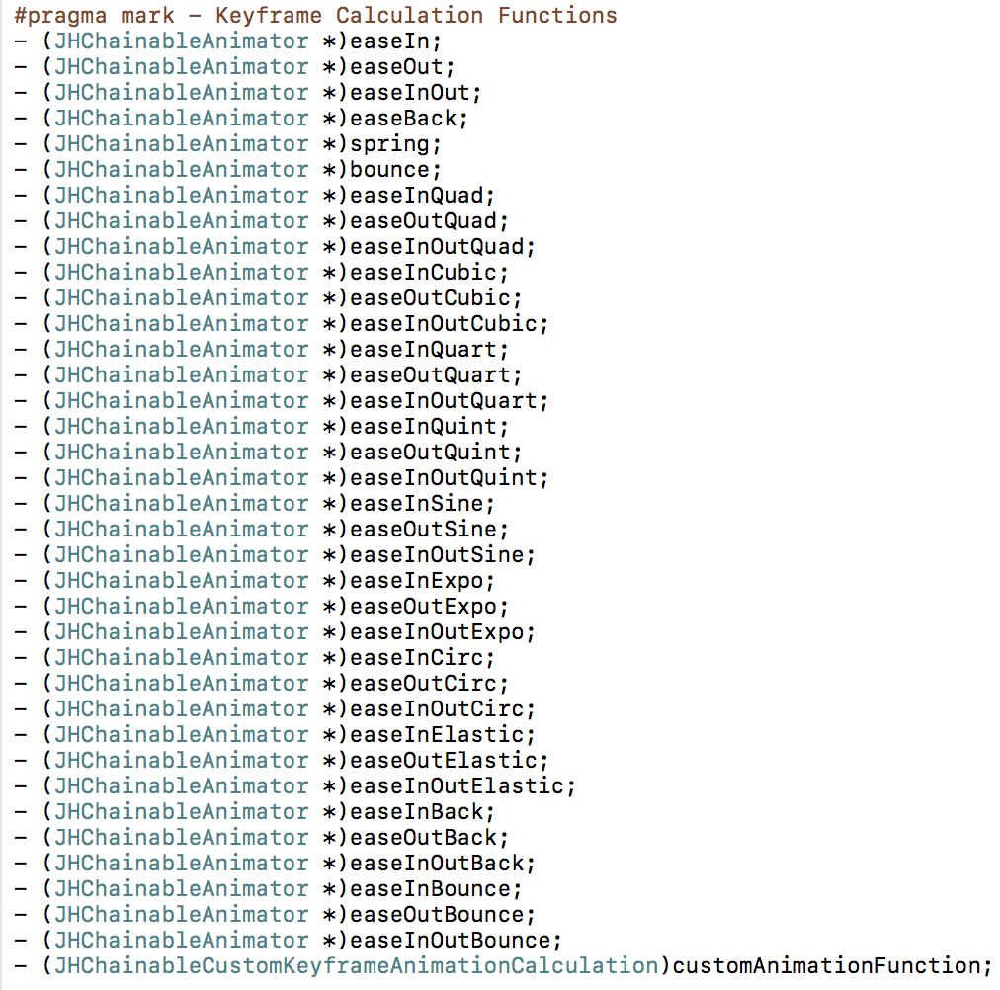
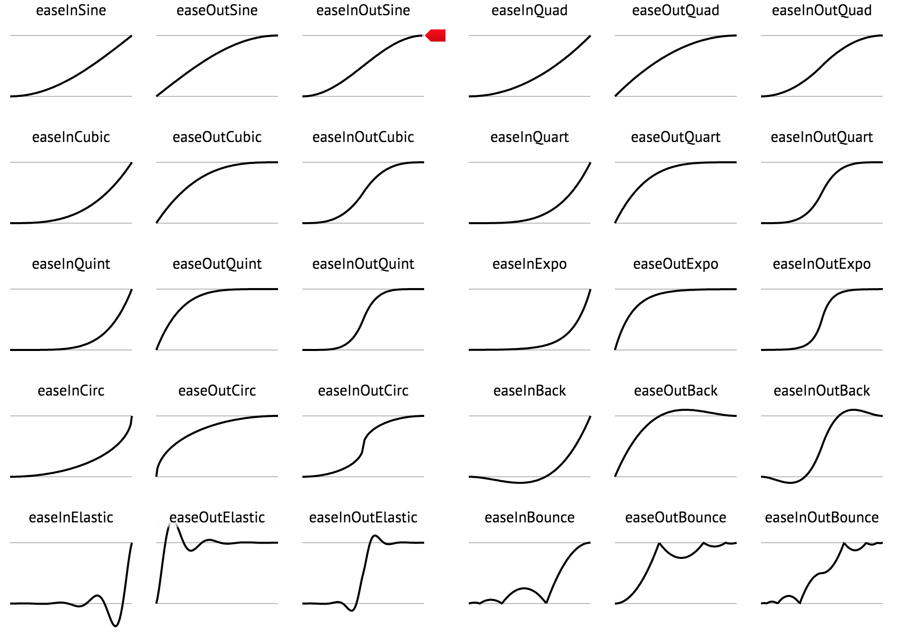
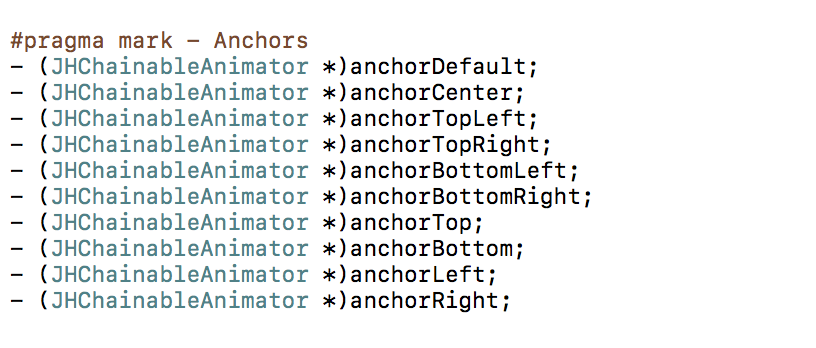

</img>

<table>
<tr>
<td width=75%">
</img>
</td>
<td width=25%">
</img>
</td>
</tr>
<tr>
<td width="75%">
</img>
</td>
<td width="25%">
</img>
</td>
</tr>
<tr>
<td width="75%">
</img>
</td>
<td width="25%">
</img>
</td>
</tr>
</table>


## Whats new in version 3.x?
* Swiftier syntax
* Swift 4 support
* Bug fixes and improvements

## Whats new in version 2.x?
* Re-architected from the ground up, no more hacking UIView 🛠
* Added pre-animation and post-animation hooks for each animation step ⛓
* Added pause and resume functionality ⏯
* Added repeat animation functionality 🔂
* Added friendly Swift interface in separate framework 🔥🕊

## Whats wrong with animations?

CAAnimations and UIView animations are extremely powerful, but it is difficult to chain multiple animations together, especially while changing anchor points. 

Furthermore, complicated animations are difficult to read. 

Say I want to move myView 50 pixels to the right with spring and then change the background color with inward easing when the movement has finished:

### The Old Way

```objective-c
    [UIView animateWithDuration:1.0
                          delay:0.0
         usingSpringWithDamping:0.8
          initialSpringVelocity:1.0
                        options:0 animations:^{
                            CGPoint newPosition = self.myView.frame.origin;
                            newPosition.x += 50;
                            self.myView.frame.origin = newPosition;
    } completion:^(BOOL finished) {
        [UIView animateWithDuration:0.5
                              delay:0.0
                            options:UIViewAnimationOptionCurveEaseIn
                         animations:^{
            self.myView.backgroundColor = [UIColor purpleColor];
        } completion:nil];
    }];
```

Thats pretty gross huh... With JHChainableAnimations it is one line of code. 

### Using JHChainableAnimations

```objective-c
JHChainableAnimator *animator = [[JHChainableAnimator alloc] initWithView:self.myView];
animator.moveX(50).spring.thenAfter(1.0).makeBackground([UIColor purpleColor]).easeIn.animate(0.5);
```

There are also a lot of really good animation libraries out there such as [RBBAnimation](https://github.com/robb/RBBAnimation), [DCAnimationKit](https://github.com/daltoniam/DCAnimationKit), and [PMTween](https://github.com/poetmountain/PMTween),  but they still fall short of having powerful chainable animations AND easy to read/write syntax. 

## Installation
There are a few ways you can add this framework to your project. The Objective-C framework is called `JHChainableAnimations` and the Swift framework is called `ChainableAnimations`. More notes on Swift usage can be found [here](#swift)

### Cocoapods

##### Objective-C

```ruby
pod 'JHChainableAnimations', '~> 3.0.1'
```
Then add the following:

```objective-c
#import <JHChainableAnimations/JHChainableAnimations.h>
```


##### Swift
```ruby
pod 'ChainableAnimations', '~> 3.0.1'
```
Then add the following:

```swift
import ChainableAnimations
```

### Carthage
Add the following to your `Cartfile`

```ruby
github "jhurray/JHChainableAnimations" ~> 3.0.1
```
##### Objective-C
Add the `JHChainableAnimations` framework to your project.

##### Swift
Add the `ChainableAnimations` framework to your project.


### Add to project Manually
Either clone the repo and manually add the Files in [JHChainableAnimations](./JHChainableAnimations)


## Usage

### Creating an Animator

To create an instance of `JHChainableAnimator` you must call the `initWithView:` method.

```objective-c
JHChainableAnimator *animator = [[JHChainableAnimator alloc] initWithView:self.myView];
```

### Animating

Chainable properties like `moveX(x)` must come between the view and the `animate(t)` function

Below is an example of how to double an objects size over the course of one second. 

```objective-c
animator.makeScale(2.0).animate(1.0);
```

### Combining Animations

If you want to move the view while you scale it, add another chainable property. Order is not important

```objective-c
animator.makeScale(2.0).moveXY(100, 50).animate(1.0);
// the same as animator.moveXY(100, 50).makeScale(2.0).animate(1.0);
```

A full list of chainable properties can be found [here](#chainables)

### Chaining Animations

To chain animations seperate the chains with the `thenAfter(t)` function.

Below is an example of how to scale and object for 0.5 seconds, and then move it for 1 second when that is done.

```objective-c
animator.makeScale(2.0).thenAfter(0.5).moveXY(100, 50).animate(1.0);
```

### Animation Effects

To add an animation effect, call the effect method after the chainable property you want it to apply to.

Below is an example of scaling a view with a spring effect.

```objective-c
animator.makeScale(2.0).spring.animate(1.0);
```

If you add 2 to the same chainable property the second will cancel the first out. 

```objective-c
animator.makeScale(2.0).bounce.spring.animate(1.0);
// The same as animator.makeScale(2.0).spring.animate(1.0);
```

A full list of animation effect properties can be found [here](#effects)

### Anchoring
To anchor your view call an achoring method at some point in an animation chain. Like effects, calling one after another in the same chain will cancel the first out. 

Below is an example of rotating a view around different anchor points

```objective-c
animator.rotateZ(180).anchorTopLeft.thenAfter(1.0).rotateZ(90).anchorCenter.animate(1.0);

// animator.rotateZ(90).anchorTopLeft.anchorCenter == animator.rotateZ(90).anchorCenter
```

A full list of anchor properties can be found [here](#anchors)

### Delays
To delay an animation call the `wait(t)` or `delay(t)` chainable property.

Below is an example of moving a view after a delay of 0.5 seconds

```objective-c
animator.moveXY(100, 50).wait(0.5).animate(1.0);
// The same as animator.moveXY(100, 50).delay(0.5).animate(1.0);
```

### Completion
To run code after an animation finishes set the `completionBlock` property of your animator or call the `animateWithCompletion(t, completion)*`function.

```objective-c
animator.makeX(0).animateWithCompletion(1.0, ^{
	NSLog(@"Animation Done");
});
```

Is the same as: 

```objective-c
animator.completionBlock = ^{
	NSLog(@"Animation Done");
};
animator.makeX(0).animate(1.0);
```

### Repeating Animations
You can repeat an animation by replacing the `thenAfter(time)` method with the `repeat(time, count)` method. This will repeat the previously defined animations. 

```objective-c
// The animator will double its scale 3 times for 0.5 seconds each before it calls `moveXY` and finishes the animation
animator.makeScale(2.0).repeat(0.5, 3).moveXY(100, 50).animate(1.0);
```

You can repeat the last part of an animation by calling `animateWithRepeat(time, count)`.

```objective-c
// The animator will double its scale then rotate by 90 degrees 3 times for 1 second each.
animator.makeScale(2.0).thenAfter(0.5).rotate(90). animateWithRepeat(1.0, 3);
```

### Pausing and Cancelling
To Pause the animation, call the `pause` method on the animator. When you call pause, the current animation in the chain will complete but nothing beyod that will be executed. You can use the `isPaused` and `isAnimating` readonly properties to inspect state. If an animation is paused but not stopped, it will still evaluate as `animating`.

To resume in a paused state, call the `resume` method on the animator.

To stop animation and clear state, call the `stop` method on the animator.

```objective-c
// In this case the `moveX` animation will execute but the `moveY` will not
// If `resume` is called `moveY` will be executed
// If `stop` is called, nothing will be executed and the animator will get a fresh state
animator.moveX(10).thenAfter(0.5).moveY(10).animate(0.5);
[animator pause];
```

### Callbacks
You can hook into the different steps of the animation process by calling the `preAnimationBlock(block)`, `animationBlock(block)`, and `postAnimationBlock(block)` methods. All take a simple block `void(^)()` as an argument. Order of calling these in the animation chain does not matter.

```objective-c
animator.moveX(10).preAnimationBlock(^{ 
	NSLog(@"before the first animation");
 }).thenAfter(1.0).postAnimationBlock(^{
 	NSLog(@"After the second animation");
 }).moveY(10).animate(1.0);
```


### Bezier Paths
You can also animate a view along a [UIBezierPath](https://developer.apple.com/library/ios/documentation/2DDrawing/Conceptual/DrawingPrintingiOS/BezierPaths/BezierPaths.html). Create a `UIBezierPath *` instance, then add points or curves or lines to it and use it in a chainable property.

```objective-c
UIBezierPath *path = [UIBezierPath bezierPath];
[path moveToPoint:self.myView.center];
[path addLineToPoint:CGPointMake(25, 400)];
[path addLineToPoint:CGPointMake(300, 500)];
animator.moveOnPath(path).animate(1.0);
```
Animation effects do not work on path movements.


## <a name="autolayout"></a>Using with Auto Layout

### Transforms

Use the **transform** chainable properties. These are better for views constrained with Autolayout. You should not mix these with other chainable properties 

```objective-c
animatorForViewWithConstraints.transformX(50).transformScale(2).animate(1.0);
```

## <a name="swift"></a>Using with Swift

Using JHChainableAnimations with [Swift](https://developer.apple.com/swift/) is now a little more readable in version `2.x`. I created a separate framework for swift that provides a class called `ChainableAnimator`. This is a thin wrapper over `JHChainableAnimator` that has a slightly more readable syntax.

```swift
let animator = ChainableAniamtor(view: myView)
animator.moveX(x: 50).thenAfter(t: 1.0).rotate(angle: 360).bounce.animate(t:1.0)
```
All Objective-C methods map to a swift method.

## <a name="chainables"></a>Chainable Properties

<table>
<tr>
<th>
Property
</th>
<th>
Takes a...
</th>
<th>
Usage
</th>
</tr>
<tr>
<td>
- (JHChainableRect) makeFrame;
</td>
<td>
CGRect
</td>
<td>
animator.makeFrame(rect).animate(1.0);
</td>
</tr>
<tr>
<td>
- (JHChainableRect) makeBounds;
</td>
<td>
CGRect
</td>
<td>
animator.makeBounds(rect).animate(1.0);
</td>
</tr>
<tr>
<td>
- (JHChainableSize) makeSize;
</td>
<td>
(CGFloat: width, CGFloat: height)
</td>
<td>
animator.makeSize(10, 20).animate(1.0);
</td>
</tr>
<tr>
<td>
- (JHChainablePoint) makeOrigin;
</td>
<td>
(CGFloat: x, CGFloat: y)
</td>
<td>
animator.makeOrigin(10, 20).animate(1.0);
</td>
</tr>
<tr>
<td>
- (JHChainablePoint) makeCenter;
</td>
<td>
(CGFloat: x, CGFloat: y)
</td>
<td>
animator.makeCenter(10, 20).animate(1.0);
</td>
</tr>
<tr>
<td>
- (JHChainableFloat) makeX;
</td>
<td>
(CGFloat: f)
</td>
<td>
animator.makeX(10).animate(1.0);
</td>
</tr>
<tr>
<td>
- (JHChainableFloat) makeY;
</td>
<td>
(CGFloat: f)
</td>
<td>
animator.makeY(10).animate(1.0);
</td>
</tr>
<tr>
<td>
- (JHChainableFloat) makeWidth;
</td>
<td>
(CGFloat: f)
</td>
<td>
animator.makeWidth(10).animate(1.0);
</td>
</tr>
<tr>
<td>
- (JHChainableFloat) makeHeight;
</td>
<td>
(CGFloat: f)
</td>
<td>
animator.makeHeight(10).animate(1.0);
</td>
</tr>
<tr>
<td>
- (JHChainableFloat) makeOpacity;
</td>
<td>
(CGFloat: f)
</td>
<td>
animator.makeOpacity(10).animate(1.0);
</td>
</tr>
<tr>
<td>
- (JHChainableColor) makeBackground;
</td>
<td>
(UIColor: color)
</td>
<td>
animator.makeBackground(color).animate(1.0);
</td>
</tr>
<tr>
<td>
- (JHChainableColor) makeBorderColor;
</td>
<td>
(UIColor: color)
</td>
<td>
animator.makeBorderColor(color).animate(1.0);
</td></tr>
<tr>
<td>
- (JHChainableFloat) makeBorderWidth;
</td>
<td>
(CGFloat: f)
</td>
<td>
animator.makeBorderWidth(3.0).animate(1.0);
</td>
</tr>
<tr>
<td>
- (JHChainableFloat) makeCornerRadius;
</td>
<td>
(CGFloat: f)
</td>
<td>
animator.makeCornerRadius(3.0).animate(1.0);
</td>
</tr>
<tr>
<td>
- (JHChainableFloat) makeScale;
</td>
<td>
(CGFloat: f)
</td>
<td>
animator.makeScale(2.0).animate(1.0);
</td>
</tr>
<tr>
<td>
- (JHChainableFloat) makeScaleX;
</td>
<td>
(CGFloat: f)
</td>
<td>
animator.makeScaleX(2.0).animate(1.0);
</td>
</tr>
<tr>
<td>
- (JHChainableFloat) makeScaleY;
</td>
<td>
(CGFloat: f)
</td>
<td>
animator.makeScaleY(2.0).animate(1.0);
</td>
</tr>
<tr>
<td>
- (JHChainablePoint) makeAnchor;
</td>
<td>
(CGFloat: x, CGFloat: y)
</td>
<td>
animator.makeAnchor(0.5, 0.5).animate(1.0);
</td>
</tr>
<tr>
<td>
- (JHChainableFloat) moveX;
</td>
<td>
(CGFloat: f)
</td>
<td>
animator.moveX(50).animate(1.0)
</td>
</tr>
<tr>
<td>
- (JHChainableFloat) moveY;
</td>
<td>
(CGFloat: f)
</td>
<td>
animator.moveY(50).animate(1.0)
</td>
</tr>
<tr>
<td>
- (JHChainablePoint) moveXY;
</td>
<td>
(CGFloat: x, CGFloat: y)
</td>
<td>
animator.moveXY(100, 50).animate(1.0)
</td>
</tr>
<tr>
<td>
- (JHChainableFloat) moveHeight;
</td>
<td>
(CGFloat: f)
</td>
<td>
animator.moveHeight(50).animate(1.0)
</td>
</tr>
<tr>
<td>
- (JHChainableFloat) moveWidth;
</td>
<td>
(CGFloat: f)
</td>
<td>
animator.moveWidth(50).animate(1.0)
</td>
</tr>
<tr>
<td>
- (JHChainableDegrees) rotateX;
</td>
<td>
(CGFloat: angle) #not radians!
</td>
<td>
animator.rotateX(360).animate(1.0);
</td>
</tr>
<tr>
<td>
- (JHChainableDegrees) rotateY;
</td>
<td>
(CGFloat: angle) #not radians!
</td>
<td>
animator.rotateY(360).animate(1.0);
</td>
</tr>
<tr>
<td>
- (JHChainableDegrees) rotateZ;
</td>
<td>
(CGFloat: angle) #not radians!
</td>
<td>
animator.rotateZ(360).animate(1.0);
</td>
</tr>
<tr>
<td>
- (JHChainablePolarCoordinate) movePolar;
</td>
<td>
(CGFloat: radius, CGFloat: angle)
</td>
<td>
animator.movePolar(30, 90).animate(1.0);
</td>
</tr>
<tr>
<td>
- (JHChainableBezierPath) moveOnPath;
</td>
<td>
(UIBezierPath *path)
</td>
<td>
animator.moveOnPath(path).animate(1.0);
</td>
</tr>
<tr>
<td>
- (JHChainableBezierPath) moveAndRotateOnPath;
</td>
<td>
(UIBezierPath *path)
</td>
<td>
animator.moveAndRotateOnPath(path).animate(1.0);
</td>
</tr>
<tr>
<td>
- (JHChainableBezierPath) moveAndReverseRotateOnPath;
</td>
<td>
(UIBezierPath *path)
</td>
<td>
animator.moveAndReverseRotateOnPath(path).animate(1.0);
</td>
</tr>
<tr>
<td>
- (JHChainableFloat) transformX;
</td>
<td>
(CGFloat f)
</td>
<td>
animator.transformX(50).animate(1.0);
</td>
</tr>
<tr>
<td>
- (JHChainableFloat) transformX;
</td>
<td>
(CGFloat f)
</td>
<td>
animator.transformX(50).animate(1.0);
</td>
</tr>
<tr>
<td>
- (JHChainableFloat) transformY;
</td>
<td>
(CGFloat f)
</td>
<td>
animator.transformY(50).animate(1.0);
</td>
</tr>
<tr>
<td>
- (JHChainableFloat) transformZ;
</td>
<td>
(CGFloat f)
</td>
<td>
animator.transformZ(50).animate(1.0);
</td>
</tr>
<tr>
<td>
- (JHChainablePoint) transformXY;
</td>
<td>
(CGFloat x, CGFloat y)
</td>
<td>
animator.transformXY(50, 100).animate(1.0);
</td>
</tr>
<tr>
<td>
- (JHChainableFloat) transformScale;
</td>
<td>
(CGFloat f)
</td>
<td>
animator.transformScale(50).animate(1.0);
</td>
</tr>
<tr>
<td>
- (JHChainableFloat) transformScaleX;
</td>
<td>
(CGFloat f)
</td>
<td>
animator.transformScaleX(50).animate(1.0);
</td>
</tr>
<tr>
<td>
- (JHChainableFloat) transformScaleY;
</td>
<td>
(CGFloat f)
</td>
<td>
animator.transformScaleY(50).animate(1.0);
</td>
</tr>
<tr>
<td>
- (JHChainableAnimator *) transformIdentity;
</td>
<td>
Nothing
</td>
<td>
animator.transformIdentity.animate(1.0);
</td>
</tr>
</table>

## <a name="effects"></a>Animation Effects




A quick look at these funcs can be found [here](http://easings.net/)

These animation functions were taken from a cool keyframe animation library that can be found [here](https://github.com/NachoSoto/NSBKeyframeAnimation)

They are based off of JQuery easing functions that can be found [here](http://gsgd.co.uk/sandbox/jquery/easing/jquery.easing.1.3.js)

## <a name="anchors"></a>Anchoring



Info on anchoring can be found [here](https://developer.apple.com/library/ios/documentation/Cocoa/Conceptual/CoreAnimation_guide/CoreAnimationBasics/CoreAnimationBasics.html#//apple_ref/doc/uid/TP40004514-CH2-SW3)


## To Do
I have gotten a ton of great suggestions of what to do next. If you think this is missing anything please let me know! The following is what I plan on working on in no particular order.

* OSX port
* Constraint animator

## Contact Info && Contributing

Feel free to email me at [jhurray33@gmail.com](mailto:jhurray33@gmail.com?subject=JHChainableAnimations). I'd love to hear your thoughts on this, or see examples where this has been used.

[MIT License](./LICENSE)
